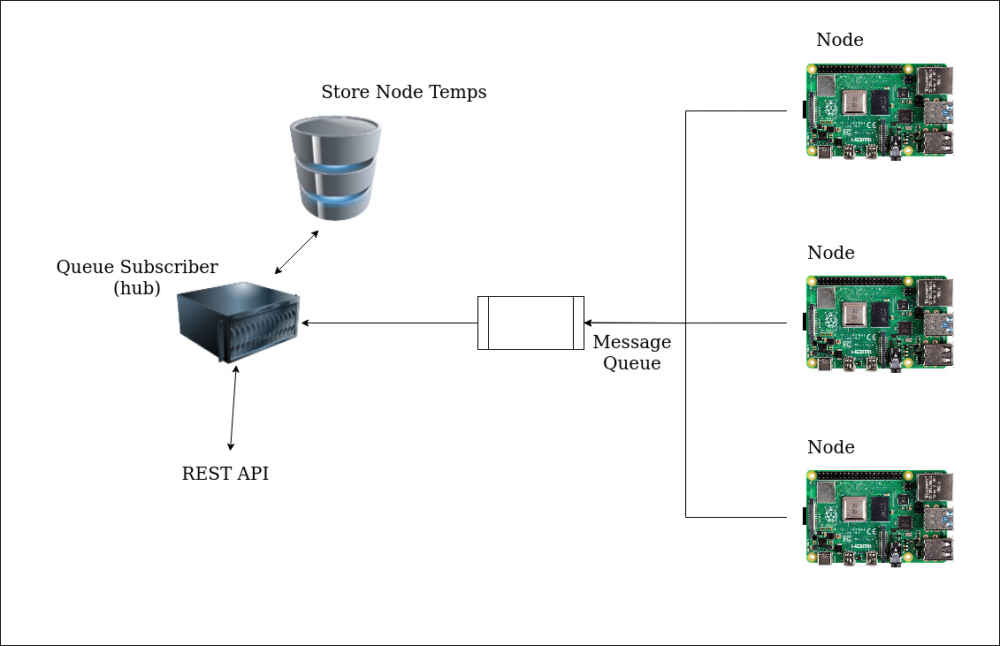

# **PDegree**
A RabbitMQ based RPI temperature sensor client for multi-node hub flow. Used in situations
where the node cannot be exposed to a public network (as in the case of
[Degree](https://github.com/kingcobra2468/Degree)) or if multiple nodes are present.

## **Schema**
The schematics of PDegree along with the hub is as illustrated below:

Using RabbitMQ with the AMQP protocol, PDegree is able to publish new temperature readings (currently done
every 5 seconds) to the specified queue. The communication makes use of Protocol Buffers, which enable
for scalabilty in the case of future integrations. The hub subscribes to the specified queue and is able to keep up-to-date temperature readings from all nodes.

## **Config**
To configure PDegree, one must first copy the `template.env` file to `src/` directory as `.env`.
From there the following options are configurable:
- **NODE_ID=** id or name that this node/sensor will go by.
- **QUEUE=** name of the queue that the hub is subscribed onto.
- **SENSOR=** sensor to use [ds18b20, dummy]. The dummy sensor is used for testing purposes
as it simply generates random values. Otherwise, use the ds18b20 sensor.
- **RABBIT_MQ_ADDRESS=** hostname for RabbitMQ server.

## **Setup**
To setup PDegree, perform the following steps:
1. Install NodeJS >=14.17 .
2. Clone repo and install dependencies with `npm install`.
3. Setup [config](#config) for PDegree.
4. Build project with `npm run build`.
5. Run with `npm run start`.